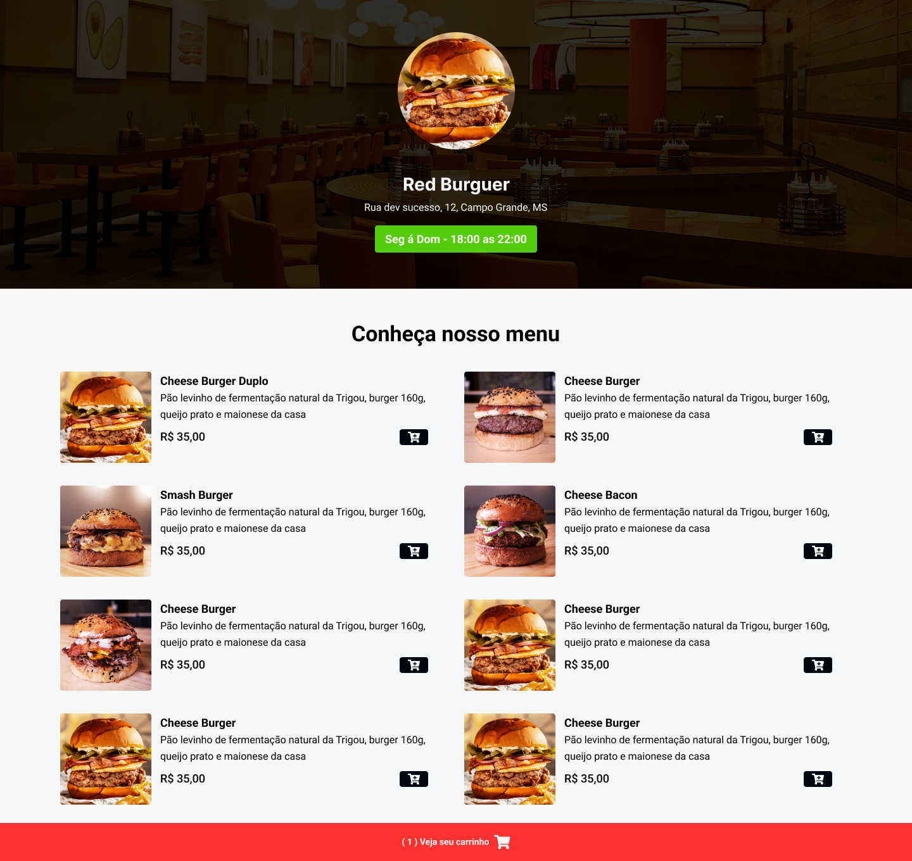
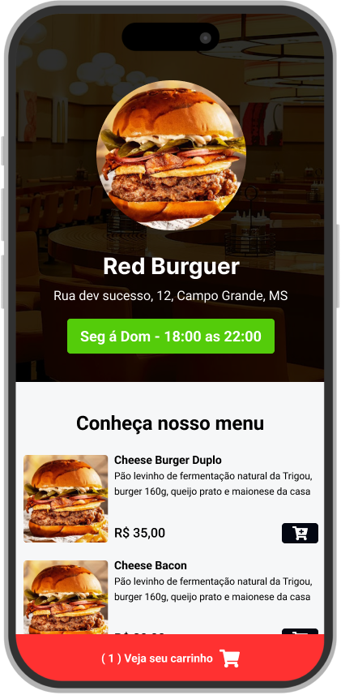
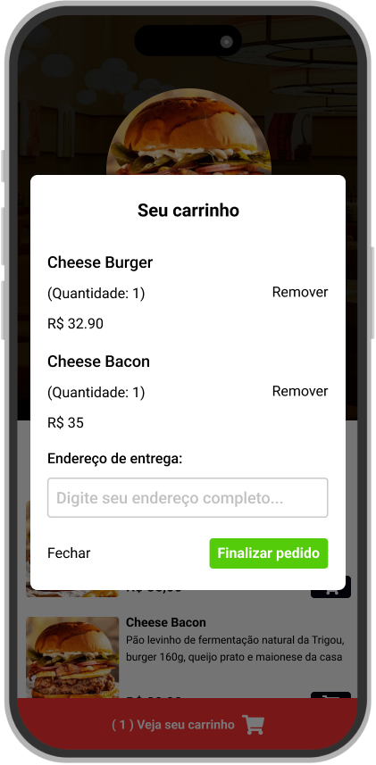

<h1 text-align="center">BurguerBross</h1>

<!--🌎 Result Preview: [Veja o Projeto](https://cardapio-finalizado.vercel.app/) -->

   
   
   
   
  
  

## 💻 Projeto - Cardapio com ReactJS

Baseado em no projeto dispinibilizado pelo youtuber Sujeito Programador, a primeira versão do projeto foi feita com HTML, TAILWIND e JS. Portanto, achei o projeto interessante e conforme nos meu avanços promovi o mesmo projeto com uma nova criação utilizando SASS/SCSS , ReactJs e TypeScript.

## 🧪 Tecnologias |

---

- Mobile First
- Unidade de medida flexível
- Variáveis
- Grid
- Animações e transições
- Media queries.
- Funções
- Callbacks
- Eventos
- Immer para prevenção de imutabilidade
- Date-fns para manipulação de datas
- React Icons

### Informações

🕛 **Status:** Concluído✔️

☑️ **Task:** Construir um site estático a partir do projeto feito no [Figma](https://www.figma.com).

- [Design Figma](<https://www.figma.com/file/oa2OsSzV6tvNkWMyDBU3jT/Restaurant---Sujeito-Programador-(Community)?type=design&node-id=0-1&mode=design&t=pVukStByJiXCaC5c-0>)

Developed by Jeferson 🚀

